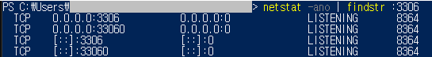
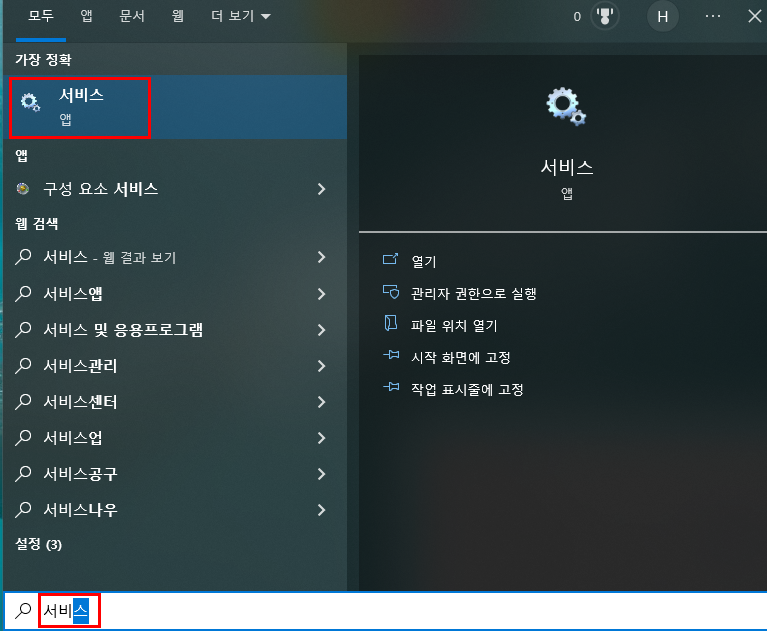
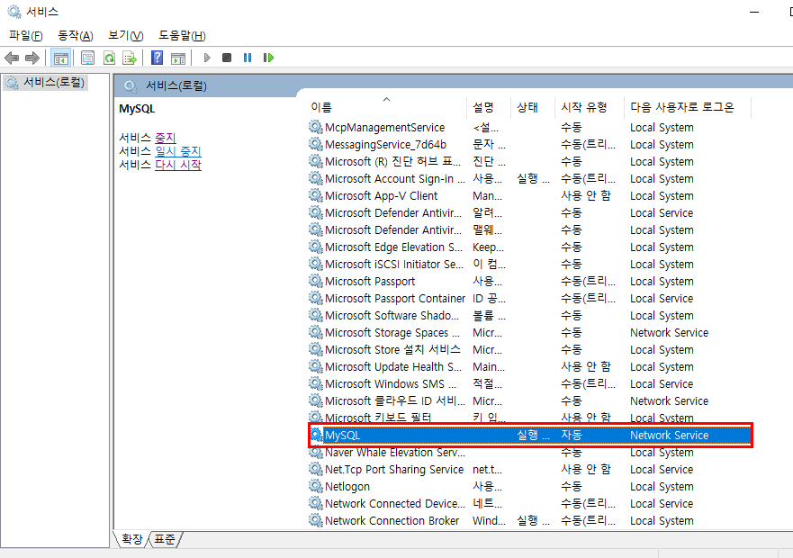
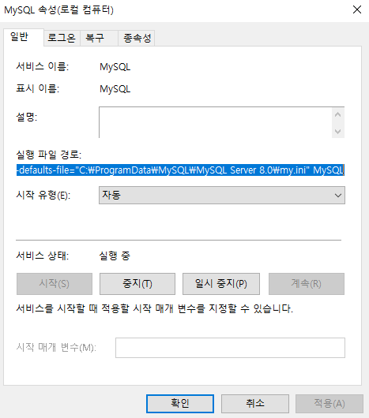
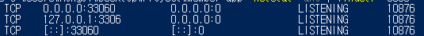

# docker mysql 포트와 local mysql 포트가 충돌났을 때 - mysql server listen ip 변경하기

## 사건(?)의 개요 😥
지금 하는 프로젝트에서 docker를 사용한다. 여기에 로그인 유저 DB 저장을 위해 mysql을 띄우고 있다. 이 docker mysql 포트를 3306으로 설정했다. 그런데 내 로컬 컴퓨터에 설치된 mysql 포트 역시 3306이었다. 

그래서 로컬 mysql이 켜져있으면 docker-compose가 안되고 docker-compose를 하고 나면 로컬 mysql을 켤 수 없는 ㅋㅋ 난항에 빠져버렸다. 그런데 더 미스테리였던 건 옆에 있던 동료의 컴에서는 된다는 거,,,,, 코드가 같은데 각자의 컴퓨터 환경에 따라서 되고 안되고 할때가 제일 난감하다. 코드 문제가 아니니깐 😂


## 상태 진단
일단은 에러메세지는 다음과 같았다.

```bash
ERROR: for girin_mysql_for_keycloak  Cannot start service girin-mysql: Ports are not available: listen tcp 0.0.0.0:3306: bind: Only one usage of each socket address (protocol/network address/port) is normally permitted.

ERROR: for girin-mysql  Cannot start service girin-mysql: Ports are not available: listen tcp 0.0.0.0:3306: bind: Only one usage of each socket address (protocol/network address/port) is normally permitted.
ERROR: Encountered errors while bringing up the project.
```

Ports are not available, 을 보자마자 포트를 어떻게 쓰고 있는지 확인을 해본다. 아래 명령어로 3306 포트를 쓰고 있는 것들의 리스트를 출력해봤다.

```bash
net stat -ano | findstr :3306
```

그랬더니 아래와 같은 결과가 나왔다.



이게 뭐지? 하고 유심히 보다가, [::]:3306에 주목했다. 여기서 [::]:3306 이 부분이 문제였다. 이게 무슨 뜻이지? 라고 검색해보니까 "모든" ip address 에 대한 3306 포트를 내 로컬 mysql이 쓰고 있었던거다. 그래서 docker에 띄운 mysql에서도 0.0.0.0:3306으로 접근하려니 안됐던 것.

그럼 저걸 어떻게 바꾸지? 무슨 키워드로 구글에 검색해야되지? 가 애매했는데 이리 저리 검색하다 보니 mysql server listen ip 라는게 있었고 이걸 mysql config 파일에서 바꿀 수 있었다.

## 해결책

### 1) mysql config 파일 찾기
윈도우인 나의 컴퓨터의 경우 아래 위치에 config가 있었다
```vim
C\ProgramData\Mysql\MySQL Server 8.0\my.ini
```
Windows 버전 MySQL의 my.ini 파일을 찾는 방법은 서비스에 들어가서 mysql 우클릭으로 실행 파일 경로를 확인할 수도 있다.








### 2) config에 listen ip 변경하는 설정 추가하기
위 경로의 my.ini 를 메모장으로 열어서, 아래 내용을 추가해줬다.
```vim
# listen ip 변경
bind-address = 127.0.0.1
```


## 😃해피한 결과!
그랬더니 된다!

다시 netstat을 조회해보니, 아래처럼 뜬다.



docker도 잘 뜨고 mysql 접속도 잘 된다.

## 하지만 이건 아직 모르겠...
근데 좀 찜찜하다. 0.0.0.0 이라는 것도 모든 IP를 의미하는데 이렇게 설정되어 있어도 되는건지에 대한 공부가 더 필요하다!