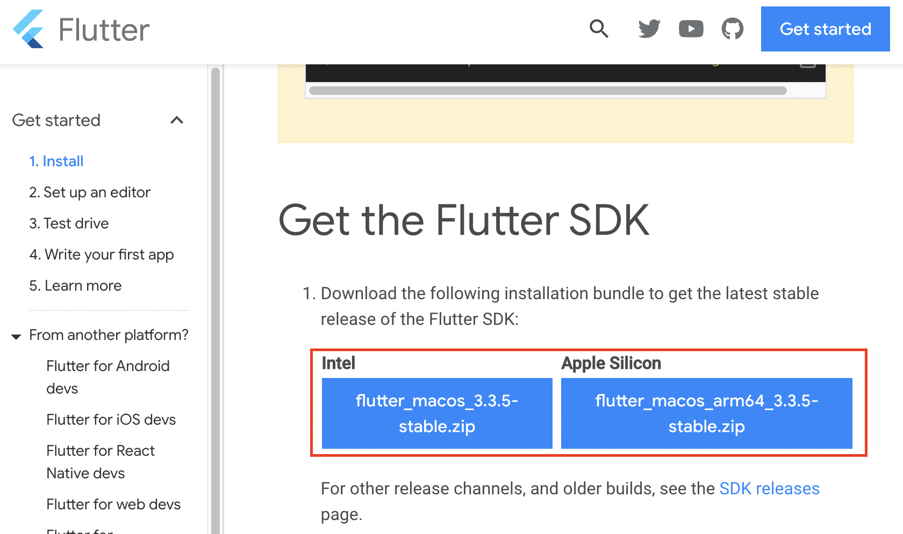
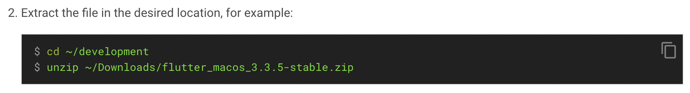
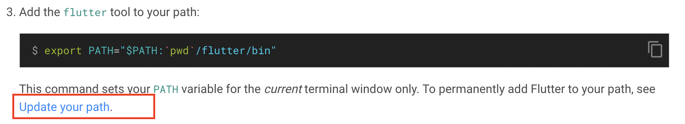
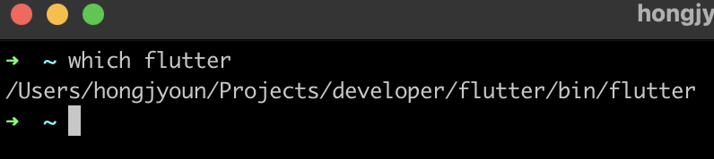

# Mac 환경에 Flutter 개발 세팅하기

## 설치 리스트
1. Flutter SDK
2. Xcode
3. 안드로이드 스튜디오
4. 


## Flutter SDK 다운로드 및 설치
### 1. 다운로드
https://docs.flutter.dev/get-started/install/macos <br>
위 공식문서로 이동하시면, 아래와 같은 다운로드 버튼이 나옵니다. 



여기서 자기 맥북 사양에 맞게 다운로드를 해줍니다. 저는 기쁘게도 M1칩을 쓰고 있어서 Apple silicon으로 선택했습니다.

### 2. 파일 압축 풀기
1번에서 받은 파일을 적당한 폴더(아무데나)에다가 압축을 풀어줍니다.
저는 ~/Projects/developer/ 폴더 안에 압축을 풀어줬습니다.



공식문서의 이 부분입니다.

### 3. PATH 추가
PATH를 추가한다는 건 무슨 뜻일까? 처음 개발을 배울 때 이게 먼말인지 이해 못했었던 기억이 납니다. 그냥 하라고 해서 복붙을 시전했더니 나중에 에러 스노우볼로 굴러왔던 적도 있었던 것 같습니다. 음, PATH를 추가한다는건, 음, 단축키/명령어를 추가한다는 것과 비슷합니다. 여기서는 'flutter'라는 명령어를 등록하는 것입니다. 왜냐면 앞으로 'flutter' 라는 명령어로 할게 많거덩요. 예를 들면 이런 거요. 

```bash
flutter doctor
```
PATH 추가하기 전에 위 명령어를 터미널에서 날려보면, '그런 명령어 없다'며 에러를 뱉을겁니다.
다시 돌아와서, 공식문서를 보면 아래와 같이 명령어를 알려줍니다. 하지만 이건 일시적인거라서 다음에 컴퓨터 다시 껐다가 키면 또 해줘야 됩니다. 그래서



저 밑에 Update your path를 클릭하면, 영구적으로 Path를 바꿔주는 방법을 알려줍니다. 우리는 영구적으로 적용해봅시다.

일단 내가 쓰는 터미널이 뭔지 확인을 해보고, 그것에 대한 설정 파일에 PATH를 수정해야 합니다. 만약 쓰는 터미널이 bash라면, .bashrc 일 거고, Z라면 .zshrc 일 건데요. 저는 .zshrc를 수정했습니다. 

```bash
cd ~
ls -al
```
홈 폴더로 이동을 합니다. cd ~ 를 입력하면, 홈 폴더로 이동합니다. 제 경우는 홈 폴더가 /Users/hongjyoun 입니다. 여기로 이동하면 .zshrc 라는 파일을 찾을 수 있습니다. 보통 숨김 파일이라서 있는지 잘 모르는데, 터미널에서 ls -al 을 입력하면 모든 파일 리스트를 볼 수 있습니다.

```bash
vim .zshrc
```
.zshrc를 편집하기 위해 vim 모드로 들어갑니다. 그리고 아래 내용을 추가해줍니다.

```vim
export PATH="$PATH:[PATH_OF_FLUTTER_GIT_DIRECTORY]/bin"
```
이걸 ~~옛날의 저처럼~~ 문자 그대로 넣으면 안되고, 대괄호 [] 안에 내용은 flutter가 설치되어 있는 폴더로 바꿔줘야 합니다. 아래처럼요.
```vim
export PATH="$PATH:/Users/hongjyoun/Projects/developer/flutter/bin"
```
그리고 아래 명령어로, 반영시켜줍니다.
```bash
source .zshrc
```
그러고 나서 아래 명령어를 실행하면, flutter 폴더 경로가 나옵니다. 그럼 잘 깔렸다는 겁니다.
```bash
which flutter
```


## Xcode 설치
Xcode는 아이폰 앱을 만들기 위해 필요합니다. 이건 별도로 파일을 다운로드 하지 않고 앱 스토어에서 검색해서 설치할 수 있습니당. 그리고 아래 명령을 입력해줍니다.

```bash
sudo xcode-select --switch /Applications/Xcode.app/Contents/Developer
sudo xcodebuild -runFirstLaunch
```
그리고 라이센스 동의를 위해 아래 명령어도 입력해줍니다.
```bash
sudo xcodebuild -license 
```

그리고 아래 명령어를 입력해서 아이폰 시뮬레이터를 열어봅니다!
```bash
open -a Simulator
```
그러면 이렇게 맥북에서 아이폰 앱을 띄워볼 수 있는 시뮬레이터가 열립니다! 이거 뜰때 쫌 감격.

## 안드로이드 스튜디오 설치
안드로이드 스튜디오는 안드로이드 앱을 만들기 위해 필요합니다.
https://developer.android.com/studio
위 사이트에서 가서 안드로이드 스튜디오를 다운로드 및 설치합니다. 이게 보니깐 intellij 랑 같은 UI 더라구요..? 

## cocoapods 설치
cocoapods가 뭔지 몰라서 검색해봤는데,

::: details cocoapod
cocoapod는 Swift 및 Objective-C Cocoa 프로젝트의 종속성 관리자 입니다.
:::

검색해봐도 모르겠어서 그냥 설치만 했습니다.
```bash
sudo gem install cocoapods
```


