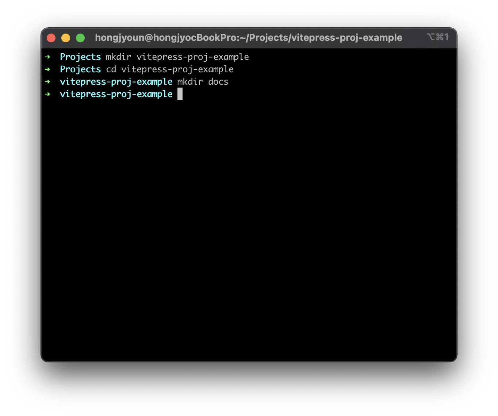

# Vitepress 프로젝트 생성하기

## Vitepress 프로젝트를 생성하는 방법
생각보다 심플하다. 크게 4가지 스텝이다.

1. 기본적인 폴더 구조를 갖춘다.
2. vue와 vitepress 패키지를 설치한다.
3. docs 폴더 안에 markdown (.md 파일)로 글을 작성한다.
4. 빌드 후 배포한다. 끝!

스텝 하나씩 자세히 살펴보자.

## 1. 기본적인 폴더 구조

```jsx
.
├─ docs
│  ├─ getting-started.md
│  └─ index.md
└─ package.json
```

위 도식이 가장 베이스가 되는 폴더 구조이다. docs 라는 이름의 폴더 안에 .md(마크다운) 파일을 생성하면 된다. 추후에 프로젝트 빌드명령어를 날리면 여기에 있는 파일들이 html 문서로 변환된다. 그리고 패키지를 관리해주는 package.json 파일이 있다. 이 파일에서는 여러 패키지들을 관리해준다. 이게 기본 폴더구조의 끝이다. 그래서 아무 폴더 하나 만든 후에, 안에다가 docs 폴더 하나 만들고, package.json 파일 만들어주면 끝!

## 2. vue와 vitepress 설치하기

yarn이나 npm 같은 패키지 매니저 아무거나 선택해서 vitepress와 vue를 설치해준다. 아래 명령어를 참고하자. 

```jsx
yarn add --dev vitepress vue
```

이렇게 명령어로 설치를 해도 되고 그냥 package.json에 devDependencies에 추가한 후에 npm install (yarn install)을 해도 된다. 원하는 특정 버전이 있거나, 여러 package들을 한번에 설치할 때는 package.json에 적는 게 더 편하다.

참고로 현재 나의 package.json은 이렇게 생겼다. css를 less로 관리하고 싶어서 less를 추가로 설치했다.

```json
{
  "name": "hongjyoun-github-blog",
  "private": true,
  "type": "module",
  "version": "0.0.0",
  "scripts": {
    "dev": "vitepress dev docs",
    "build": "vitepress build docs",
    "serve": "vitepress serve docs --port 3000"
  },
  "devDependencies": {
    "less": "^4.1.3",
    "vitepress": "^1.0.0-alpha.19",
    "vue": "^3.2.37"
  }
}
```

## 3. docs 폴더에 .md 파일 만들어서 작성해보기

docs 폴더에 index.md (다른 이름이어도 좋다) 파일을 만들어서 제목을 입력해보자. 마크다운 문서는 마크다운 문법으로 작성해야 해서 그 전에 문법을 약간 익히는 시간이 필요하다. 하지만 별로 어렵지 않아서 금방 할 수 있다. 오히려 단축키같은 느낌이어서 작성시에 편할 때도 있다. 그리고 기본 마크다운 뿐 아니라, vitepress 에서 제공하는 디자인에 대한 코드도 있어서 이걸 활용해서 다채로운 글을 작성해볼 수도 있다. 이 부분은 나중에 따로 글로 다루도록 하겠슴!

```markdown
### 제목을 입력해보자
```

## 4. 빌드하고 배포하기

위에 참고로 적어놓은 package.json을 보면 scripts 가 추가되어 있는 것을 볼 수 있다. Vitepress 공식문서에 따르면, 아래와 같은 스크립트 명령어를 추가하라고 되어 있다.

```json
{
  ...
  "scripts": {
    "docs:dev": "vitepress dev docs",
    "docs:build": "vitepress build docs",
    "docs:serve": "vitepress serve docs"
  },
  ...
}
```

나는 저기서 docs: 이 부분을 생략했다 ㅋ 번거로워서.. 우쨌든, vitepress dev docs 는 로컬에서 개발모드로 사이트를 띄워볼 수 있고, build를 하면 docs/.vitepress/dist 폴더 안에 html 파일들이 만들어지는 것을 확인할 수 있다!


vitepress dev docs 명령어를 입력해서 로컬에서 사이트를 띄워보자. 내가 만든 [index.md](http://index.md) 파일이 html로 변환되어 나오는 걸 확인할 수 있다.

프로젝트 생성에서부터 페이지를 띄우는 것까지 이미지로 보면 다음과 같다!


vitepress-proj-example 이라는 폴더를 만들고, 그 안에 docs 라는 폴더를 만들었다.


package.json 파일을 만들어서 그 안에 내용을 넣었다.


npm install로 패키지 설치


index.md 파일 만들어서 내용을 간단히 적어주고


npm run dev 명령어를 날리면, 5174 포트에 띄워진다.


짠, 심플한 네비게이션과 페이지가 생성된걸 볼 수 있다


기특하게도 Dark mode를 기본으로 지원한다.


이제 이걸 어딘가에 배포를 해야된다. 빌드 후 생성된 파일들을 보면 static html 파일들임을 알 수 있는데, 이런 정적 페이지들을 배포해주는 서비스들은 시중이 많이 있다. 나같은 경우는 그 중에서도 github pages 서비스를 이용해서 배포했다. 깃헙 계정이 있으면 아이디 1개당 1개의 홈페이지를 무료로 만들 수 있어서 쉽고 간편하다 ㅋ github pages에 배포하는 방법은 추후 글로 다시 다루기로 하겠음!